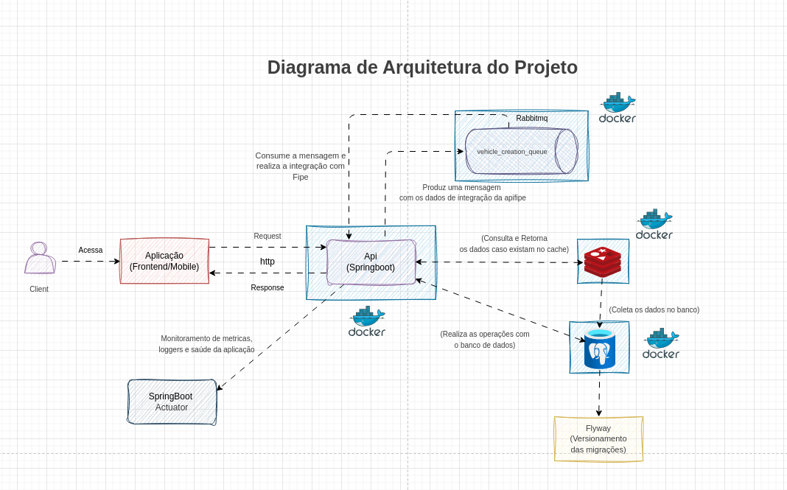
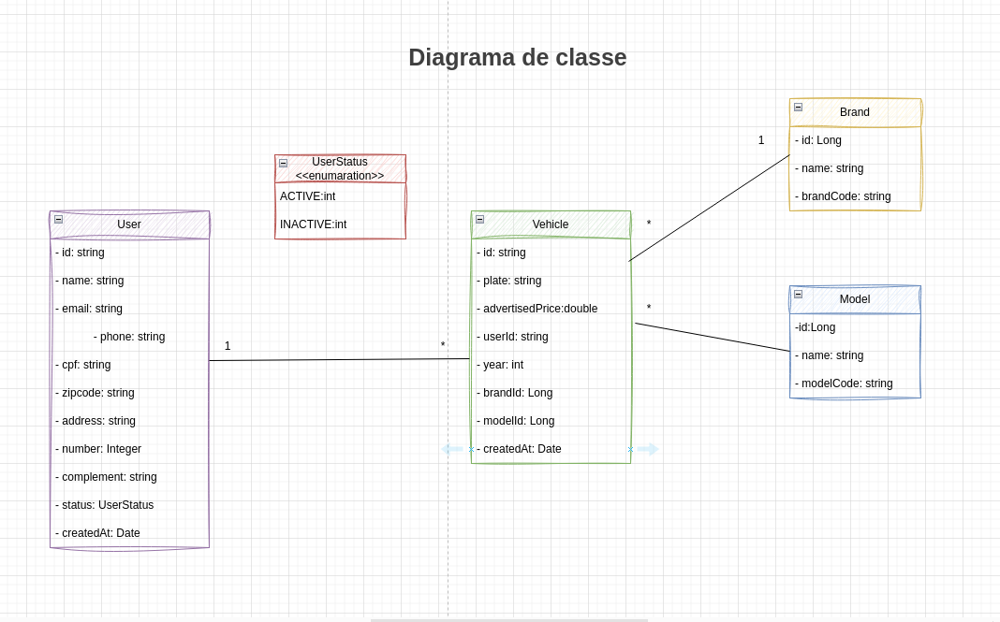

# PowerCrm - Teste Técnico

Este projeto foi desenvolvido como parte do teste técnico para a vaga de Desenvolvedor Java. O sistema consiste em um backend para gerenciamento de usuários e veículos, com integração à API da Tabela FIPE e comunicação assíncrona via RabbitMQ.

## ⚙️ Tecnologias e Ferramentas

- Java 17
- Spring Boot
- Spring Data JPA
- PostgreSQL / H2
- RabbitMQ
- Redis (Cache)
- OpenFeign
- Flyway
- Docker
- Lombok
- Validation
- Mapstruct
- JUnit + Mockito

## 📆 Organização do Projeto

- `controller/`: endpoints REST
- `service/`: regras de negócio
- `repository/`: acesso ao banco de dados
- `external/fipe/`: integração com a API FIPE
- `config/`: configurações de Feign, Swagger, RabbitMQ, cache etc.
- `domain/entities`: entidades de negócio.
- `domain/features/module`: casos de uso da aplicação.
- `validators/`: classes de validação de dados.
- `dto/`: objetos de transferência de Dados.
- `utils/`: camada de metódos de utilitários.
## 📱 Funcionalidades

- Cadastro e listagem de usuários
- Cadastro e listagem de veículos
- Integração com a API da FIPE para validação e obtenção de valores
- Cache com Redis para performance
- Validação de dados e tratamento de exceções
- Comunicação assíncrona com RabbitMQ:
    - Fila principal, fila de retry e DLQ
- Versionamento do banco com Flyway

## 📁 Executando o Projeto

Requisitos:
- Docker
- Docker Compose

### 🐳 Subindo a aplicação

```bash
docker-compose up --build
```

A API estará disponível em: `http://localhost:8080/api`

Swagger: `http://localhost:8080/api/swagger-ui.html`

H2 Console: `http://localhost:8080/api/h2-console`

## 📄 Considerações Finais

---
O projeto foi estruturado seguindo boas práticas de arquitetura, separação de responsabilidades e foco em código limpo e testável.

📨 Em caso de dúvidas acesse a pasta documentation para ter uma visão detalhada dos requisitos. 

Os prompts que foram usados no projetos estão localizados no arquivo prompts.txt

## 🧩 Diagrama da Arquitetura




## 🧩 Diagrama de Classe
